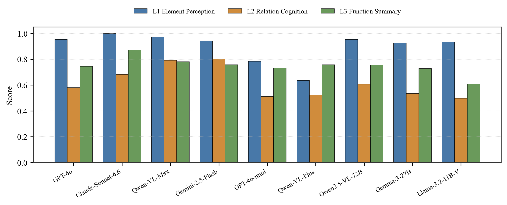
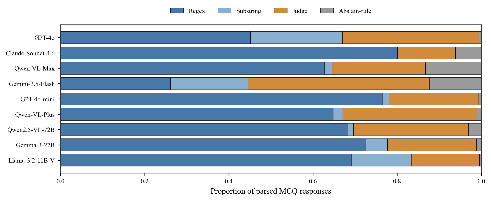
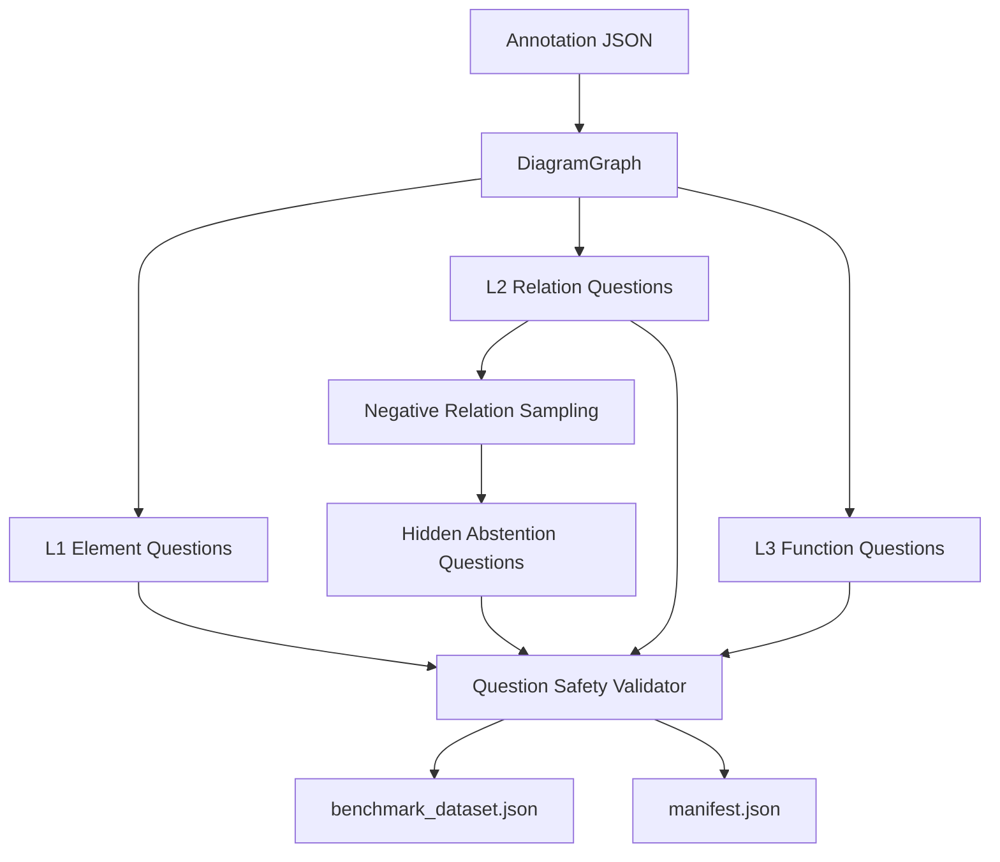
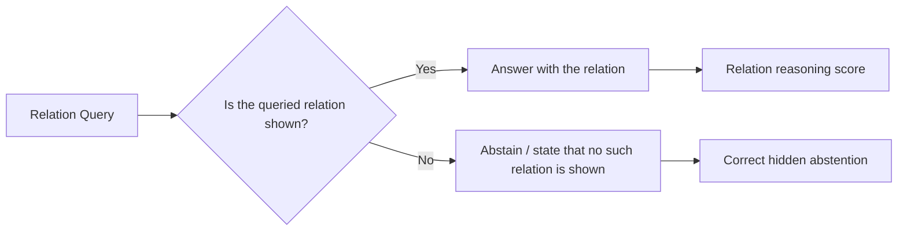
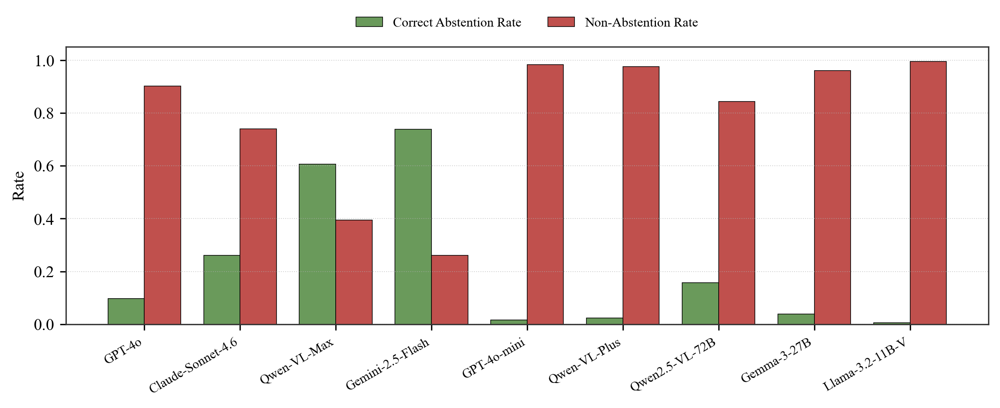
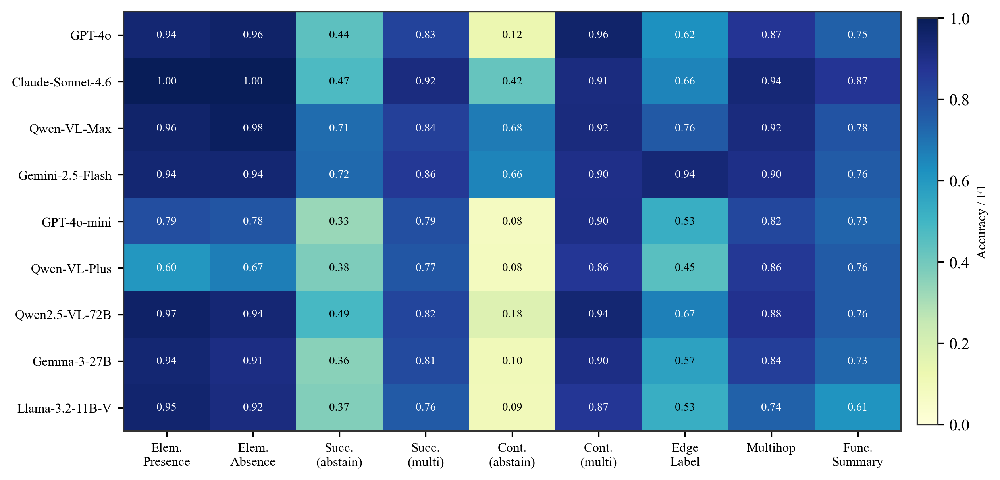

# AcademicBench: Benchmarking Multimodal Logical Reasoning over Academic Diagrams

**AcademicBench** is a benchmark for evaluating multimodal large language models (MLLMs) on structured reasoning over academic framework diagrams.

Academic framework diagrams are widely used in research papers to describe system architectures, algorithmic workflows, module relations, and conceptual structures. However, existing multimodal benchmarks mainly focus on natural images, document understanding, or statistical charts, providing limited diagnosis of whether MLLMs can reason over structured academic diagrams or abstain when a queried relation is absent.

> **Status:** Submitted to NLPCC 2026, under review.

---

## Overview

AcademicBench evaluates MLLMs across three levels of academic diagram understanding:

1. **Element Perception**  
   Identifying entities, modules, components, and visual elements in academic framework diagrams.

2. **Relation Cognition**  
   Understanding directed relations, containment relations, edge labels, successor relations, and multi-hop reasoning chains.

3. **Function Summarization**  
   Summarizing the overall function and high-level purpose of an academic framework diagram.

The benchmark further introduces **hidden abstention testing**, where unanswerable relation queries are mixed with answerable questions to evaluate whether models over-answer when queried relations are absent.

<p align="center">
  
</p>

---

## Benchmark Scale

AcademicBench currently contains:

| Item | Scale |
|---|---:|
| Academic framework diagrams | **300** |
| Automatically generated questions | **1,910** |
| L1 questions | **598** |
| L2 questions | **1,012** |
| L3 questions | **300** |
| Evaluation levels | **3** |
| Evaluated MLLMs | **9** |

---

## Benchmark Pipeline

The full AcademicBench pipeline consists of five main stages: figure collection, manual selection and preparation, graph-based annotation, automatic question generation, and MLLM evaluation.

```mermaid
flowchart LR
    A[arXiv / Paper Collection] --> B[Figure Extraction and Gallery Review]
    B --> C[Manual Diagram Selection]
    C --> D[Graph-based Annotation]
    D --> E[Benchmark Question Generation]
    E --> F[Question Safety Validation]
    F --> G[MLLM Evaluation]
    G --> H[Metrics and Error Analysis]
    H --> I[Visualization and Human Check]
```



The project first collects candidate figures from research papers, then manually selects academic framework diagrams. Each selected diagram is annotated as a structured graph and converted into benchmark questions through an automatic generation pipeline. The generated questions are validated before being used for MLLM evaluation and error analysis.

<p align="center">
  
</p>

---

## Annotation Schema

Each academic framework diagram is annotated as a directed graph. The annotation includes a diagram-level summary, typed entities, and relations.

The current annotation schema uses:

- **Entities:** `Node`, `Container`
- **Relations:** `flows_to`, `contains`, `connects_to`
- **Diagram-level summary:** a global functional description of the diagram

Example anonymized annotation:

```json
{
  "image_id": "sample_001",
  "paper_id": "anonymous_paper",
  "summary": "The diagram describes a modular architecture that transforms input data into predictions through feature extraction and reasoning.",
  "entities": [
    {
      "id": "E1",
      "name": "Input Module",
      "type": "Node"
    },
    {
      "id": "E2",
      "name": "Feature Extractor",
      "type": "Node"
    },
    {
      "id": "E3",
      "name": "Reasoning Module",
      "type": "Node"
    }
  ],
  "relations": [
    {
      "source": "E1",
      "target": "E2",
      "type": "flows_to",
      "label": "input data"
    },
    {
      "source": "E2",
      "target": "E3",
      "type": "flows_to",
      "label": "feature representation"
    }
  ]
}
```

This annotation supports graph-based queries such as entity lookup, incoming and outgoing edges, successor retrieval, containment relations, edge-label reasoning, multi-hop path search, and negative relation sampling.

---

## Question Generation

AcademicBench automatically generates questions from graph annotations.

The current question generation pipeline covers:

- **L1 Element Perception**
  - Element presence
  - Element absence
  - Basic entity-level recognition

- **L2 Relation Cognition**
  - Successor relation reasoning
  - Containment relation reasoning
  - Edge-label understanding
  - Multi-hop relation reasoning
  - Hidden abstention on absent relations

- **L3 Function Summarization**
  - Diagram-level function summary
  - High-level purpose understanding



Question generation is implemented mainly through:

- `src/logic_engine.py`
- `src/prompt_generator.py`
- `question_safety_validator.py`
- `generate_benchmark.py`

---

## Hidden Abstention

In ordinary visual question answering, a model is usually expected to answer every question. However, in academic framework diagrams, some queried relations may not exist in the diagram.

AcademicBench therefore introduces **hidden abstention testing**:

- Answerable relation questions and unanswerable relation questions are mixed together.
- The model is not explicitly told which questions are unanswerable.
- A reliable model should abstain when the queried relation is absent instead of hallucinating unsupported relations.



This design helps evaluate whether MLLMs can distinguish between **supported relations** and **non-existent relations** in structured academic diagrams.

<p align="center">
  
</p>

---

## Evaluation

The evaluation pipeline loads `benchmark_dataset.json` and diagram images, sends questions to multimodal model backends, parses model responses, and aggregates metrics.

The main evaluation entry point is:

```bash
python "Run evaluation.py"
```

The evaluation script supports multiple model backends, including OpenRouter-compatible APIs and other mainstream model providers. It also supports image compression, retry logic, JSONL caching, answer parsing, open-ended response judging, and metric aggregation.

The main output files include:

- `results/cache.jsonl`
- `results/results_detail.json`
- `results/metrics.json`
- `results/human_check_l2.json`
- `results/l2_review.html`

---

## Key Findings

We evaluate **nine mainstream MLLMs** on AcademicBench.

Main findings include:

- **Relation cognition is the main bottleneck**, with an average L2 score of **0.615**, substantially lower than element-level perception.
- Models often over-answer when queried relations are absent.
- Non-abstention rates on unanswerable relation queries range from **26.2% to 99.4%**.
- A human check on sampled L2 questions reaches **95.4%**, suggesting that the observed performance gap mainly reflects model limitations rather than ambiguous question design.

<p align="center">
  
</p>

---

## Error Analysis

AcademicBench includes relation-level error analysis and human checking scripts for diagnosing model behavior on L2 questions.

Common error modes include:

1. **Element Recognition Errors**  
   Models fail to identify key modules, components, or text labels in academic framework diagrams.

2. **Directionality Errors**  
   Models recognize that two entities are related but misunderstand the direction of the relation.

3. **Containment Errors**  
   Models fail to correctly identify whether an entity is contained within another component or region.

4. **Edge-label Misinterpretation**  
   Models incorrectly interpret the semantic meaning of an edge label or arrow annotation.

5. **Multi-hop Reasoning Failure**  
   Models fail to correctly infer relations that require understanding multiple connected components or intermediate reasoning steps.

6. **Relation Hallucination**  
   Models infer non-existent relations between entities when no such edge is present.

7. **Over-answering on Hidden Abstention Queries**  
   Models provide unsupported answers for unanswerable relation queries instead of abstaining.

---

## Project Structure

```text
AcademicBench/
├── data/
│   ├── annotations/        # Graph annotations for framework diagrams
│   ├── images/             # Diagram images used by the benchmark
│   └── pdfs/               # Source papers; not included in public release
├── arxiv_data/             # Large-scale arXiv collection and figure extraction outputs
│   ├── pdfs/
│   ├── figures/
│   ├── images/
│   ├── figure1_pages/
│   ├── gallery.html
│   ├── metadata_figures.csv
│   ├── processed_ids.txt
│   ├── run.log
│   └── state.json
├── src/
│   ├── data_loader.py
│   ├── evaluator.py
│   ├── logic_engine.py
│   ├── model_client.py
│   ├── prompt_generator.py
│   └── __init__.py
├── results/
│   ├── cache.jsonl
│   ├── cache.smoke.jsonl
│   ├── metrics.json
│   ├── results_detail.json
│   ├── human_check_l2.json
│   └── l2_review.html
├── figures/
│   ├── fig1_overall_levels.png
│   ├── fig2_abstention.png
│   ├── fig3_qtype_heatmap.png
│   └── fig4_parse_stages.png
├── annotation_tool.py
├── arxiv_figure_gallery.py
├── arxiv_pipeline_collector_v2.py
├── generate_benchmark.py
├── Run evaluation.py
├── plot_results.py
├── error_analysis.py
├── human_check_l2.py
├── inspect_l2.py
├── l2_visual_report.py
├── question_safety_validator.py
├── benchmark_dataset.json
├── manifest.json
├── requirements.txt
└── requirements_eval.txt
```

---

## Main Components

| File | Description |
|---|---|
| `annotation_tool.py` | Streamlit-based annotation interface for creating graph annotations from diagram images. |
| `src/logic_engine.py` | Converts annotation JSON files into `DiagramGraph` objects and supports graph queries such as successors, containment, edge labels, multi-hop paths, and negative relation sampling. |
| `src/prompt_generator.py` | Generates L1/L2/L3 benchmark questions from graph annotations. |
| `question_safety_validator.py` | Validates generated questions, including answer consistency, option uniqueness, graph-groundedness, and multi-hop correctness. |
| `generate_benchmark.py` | Main benchmark generation entry point. It reads `data/annotations/` and outputs `benchmark_dataset.json` and `manifest.json`. |
| `Run evaluation.py` | Main evaluation entry point for running MLLM evaluation and producing result files. |
| `plot_results.py` | Generates paper figures from `results/metrics.json`. |
| `error_analysis.py` | Performs error analysis on model outputs. |
| `human_check_l2.py` | Supports human checking for sampled L2 questions. |
| `l2_visual_report.py` | Generates a visual review report for L2 evaluation. |
| `arxiv_figure_gallery.py` | Supports arXiv figure extraction and gallery generation. |
| `arxiv_pipeline_collector_v2.py` | Supports arXiv paper collection, PDF downloading, and figure extraction. |

---

## Reproducibility Notes

This public repository is intended to provide a research overview, benchmark design, and reproducibility reference.

Some files are not included in the public release due to size, licensing, privacy, or review-stage concerns:

- `arxiv_data/`
- Raw paper PDFs
- Most original diagram images
- Full model output caches
- Full detailed evaluation outputs
- API keys or local environment files

The following files should **not** be publicly released:

- `.env`
- Files containing hardcoded API keys
- Temporary test scripts with private credentials
- Large raw PDF or figure extraction outputs

---

## Basic Usage

### 1. Install dependencies

```bash
pip install -r requirements.txt
pip install -r requirements_eval.txt
```

### 2. Launch the annotation tool

```bash
streamlit run annotation_tool.py
```

### 3. Generate benchmark questions

```bash
python generate_benchmark.py
```

This generates:

- `benchmark_dataset.json`
- `manifest.json`

### 4. Run model evaluation

```bash
python "Run evaluation.py"
```

### 5. Generate result figures

```bash
python plot_results.py
```

---

## Research Directions

AcademicBench can support future research on:

- Multimodal large language model evaluation
- Structured visual reasoning
- Academic diagram understanding
- Hidden abstention and hallucination analysis
- Benchmark construction for scientific and technical diagrams
- Error diagnosis of MLLMs on relation-level reasoning tasks
- Reliable abstention in multimodal reasoning systems

---

## Citation

The paper is currently under review. Citation information will be updated after publication.

---

## Contact

Peilin Jia  
Email: your_email@example.com
