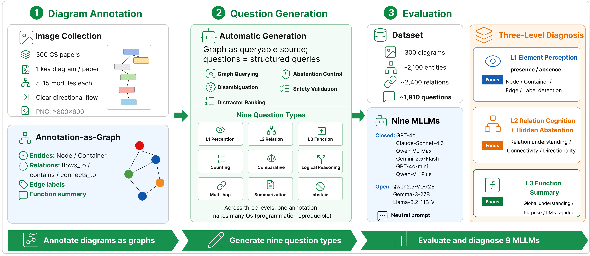
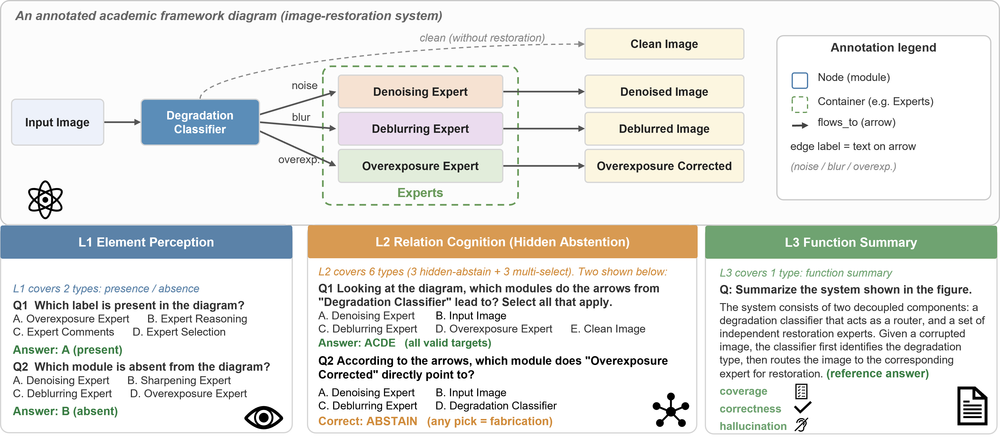

# AcademicBench: Benchmarking Multimodal Logical Reasoning over Academic Diagrams

**AcademicBench** is a benchmark for evaluating multimodal large language models (MLLMs) on structured reasoning over academic framework diagrams.

Academic framework diagrams are widely used in research papers to describe system architectures, algorithmic workflows, module relations, and conceptual structures. However, existing multimodal benchmarks mainly focus on natural images, document understanding, or statistical charts, providing limited diagnosis of whether MLLMs can reason over structured academic diagrams or abstain when a queried relation is absent.

> **Status:** Submitted to NLPCC 2026, under review.

---

## Overview

AcademicBench evaluates MLLMs on three levels of academic diagram understanding:

1. **Element Perception**  
   Identifying entities, modules, components, containers, and visual elements in academic framework diagrams.

2. **Relation Cognition**  
   Understanding directed flows, containment relations, edge labels, successor relations, and multi-hop logical chains.

3. **Function Summarization**  
   Summarizing the overall function and high-level purpose of an academic framework diagram.

The benchmark further introduces **hidden abstention testing**, where unanswerable relation queries are mixed with answerable questions to evaluate whether models over-answer when queried relations are absent.

<p align="center">
  
</p>

---

## Benchmark Scale

AcademicBench currently contains:

| Item | Scale |
|---|---:|
| Academic framework diagrams | **300** |
| Automatically generated questions | **1,910** |
| L1 element perception questions | **598** |
| L2 relation cognition questions | **1,012** |
| L3 function summarization questions | **300** |
| Evaluation levels | **3** |
| Evaluated MLLMs | **9** |

---

## Benchmark Construction Pipeline

AcademicBench follows a graph-centered benchmark construction pipeline:

1. **Diagram collection and selection**  
   Academic framework diagrams are collected from research papers and filtered to retain clear diagrams with interpretable module structures, relations, and functional flow.

2. **Graph-based annotation**  
   Each diagram is manually annotated as a graph with typed entities, directed relations, edge labels, and a diagram-level functional summary.

3. **Automatic question generation**  
   The graph annotation is converted into L1/L2/L3 questions through rule-based generation and graph querying.

4. **Question safety validation**  
   Generated questions are checked for option uniqueness, answer consistency, graph-groundedness, and multi-hop correctness.

5. **MLLM evaluation and error analysis**  
   Nine mainstream MLLMs are evaluated on the generated questions, followed by metric aggregation, hidden abstention analysis, and human checking on sampled L2 questions.

Raw paper PDFs, large-scale crawled figures, and crawler intermediate files are not included in this public repository due to size and licensing concerns.

---

## Annotation Schema

Each academic framework diagram is annotated as a graph with a diagram-level summary, typed entities, and directed relations.

The current annotation schema uses:

- **Entity types:** `Node`, `Container`
- **Relation predicates:** `flows_to`, `contains`, `connects_to`
- **Edge text:** optional text labels attached to arrows or relations
- **Function summary:** a global description of the diagram's purpose

Example anonymized annotation:

```json
{
  "image_id": "sample_001.png",
  "paper_id": "anonymous_paper",
  "summary": {
    "text": "The framework transforms an input image into task-specific outputs through degradation classification and expert modules."
  },
  "entities": [
    {
      "id": "e0",
      "text": "Input Image",
      "type": "Node"
    },
    {
      "id": "e1",
      "text": "Degradation Classifier",
      "type": "Node"
    },
    {
      "id": "e5",
      "text": "Experts",
      "type": "Container"
    }
  ],
  "relations": [
    {
      "subject_id": "e0",
      "predicate": "flows_to",
      "object_id": "e1",
      "edge_text": "",
      "is_conflict": false
    },
    {
      "subject_id": "e1",
      "predicate": "flows_to",
      "object_id": "e2",
      "edge_text": "noise",
      "is_conflict": false
    },
    {
      "subject_id": "e5",
      "predicate": "contains",
      "object_id": "e2",
      "edge_text": "",
      "is_conflict": false
    }
  ]
}
```

The graph representation supports entity lookup, incoming and outgoing relation queries, successor retrieval, containment reasoning, edge-label reasoning, multi-hop path search, and negative relation sampling.

---

## Task Design

AcademicBench automatically generates questions from graph annotations.

The benchmark contains **nine question types** across three levels:

| Level | Main Ability | Question Focus |
|---|---|---|
| L1 | Element Perception | Element presence, element absence, entity-level recognition |
| L2 | Relation Cognition | Successor reasoning, containment reasoning, edge-label understanding, multi-hop reasoning, hidden abstention |
| L3 | Function Summarization | Diagram-level function and purpose summarization |

<p align="center">
  
</p>

The question generation pipeline is mainly implemented through:

- `src/logic_engine.py`
- `src/prompt_generator.py`
- `question_safety_validator.py`
- `generate_benchmark.py`

---

## Hidden Abstention

In ordinary visual question answering, a model is usually expected to answer every question. However, in academic framework diagrams, some queried relations may not exist in the diagram.

AcademicBench introduces **hidden abstention testing**:

- Answerable relation questions and unanswerable relation questions are mixed together.
- The model is not explicitly told which questions are unanswerable.
- A reliable model should abstain when the queried relation is absent instead of hallucinating unsupported relations.

This design helps evaluate whether MLLMs can distinguish between **supported relations** and **non-existent relations** in structured academic diagrams.

<p align="center">
  
</p>

---

## Evaluation Protocol

The evaluation pipeline loads `benchmark_dataset.json` and diagram images, sends questions to multimodal model backends, parses model responses, and aggregates metrics.

The main evaluation script supports:

- Multiple model backends through API calls
- Image compression before model calls
- Concurrent requests
- Retry logic
- JSONL caching for resumable evaluation
- Single-choice and multi-choice answer parsing
- Open-ended summary judging
- Metric aggregation and result export

The main output files include:

- `results/cache.jsonl`
- `results/results_detail.json`
- `results/metrics.json`
- `results/human_check_l2.json`
- `results/l2_review.html`

These detailed result files are not fully included in the public demo release. The repository instead provides aggregated statistics and final visualization figures.

---

## Key Findings

We evaluate **nine mainstream MLLMs** on AcademicBench.

Main findings include:

- **Relation cognition is the main bottleneck**, with an average L2 score of **0.615**, substantially lower than element-level perception.
- Models often over-answer when queried relations are absent.
- Non-abstention rates on unanswerable relation queries range from **26.2% to 99.4%**.
- A human check on sampled L2 questions reaches **95.4%**, suggesting that the observed performance gap mainly reflects model limitations rather than ambiguous question design.

<p align="center">
  
</p>

---

## Error Analysis

AcademicBench includes relation-level error analysis and human checking for diagnosing model behavior on L2 questions.

Common error modes include:

1. **Element Recognition Errors**  
   Models fail to identify key modules, components, or text labels in academic framework diagrams.

2. **Directionality Errors**  
   Models recognize that two entities are related but misunderstand the direction of the relation.

3. **Containment Errors**  
   Models fail to correctly identify whether an entity is contained within another component or region.

4. **Edge-label Misinterpretation**  
   Models incorrectly interpret the semantic meaning of an edge label or arrow annotation.

5. **Multi-hop Reasoning Failure**  
   Models fail to infer relations that require understanding multiple connected components or intermediate reasoning steps.

6. **Relation Hallucination**  
   Models infer non-existent relations between entities when no such edge is present.

7. **Over-answering on Hidden Abstention Queries**  
   Models provide unsupported answers for unanswerable relation queries instead of abstaining.

---

## Project Structure

This public repository focuses on the core benchmark construction and evaluation workflow. Large raw data, crawled PDFs, extracted figure pools, API caches, full per-sample outputs, and temporary debugging scripts are excluded.

```text
AcademicBench/
├── src/
│   ├── logic_engine.py           # DiagramGraph representation and graph query utilities
│   └── prompt_generator.py       # Automatic L1/L2/L3 question generation
├── data/
│   ├── annotations/              # Sample graph annotations
│   └── images/                   # Sample framework diagram images
├── figures/                      # Final figures used in the paper/demo
│   ├── pipeline_overview.png
│   ├── task_example.png
│   ├── fig1_overall_levels.png
│   ├── fig2_abstention.png
│   ├── fig3_qtype_heatmap.png
│   └── fig4_parse_stages.png
├── annotation_tool.py            # Streamlit annotation interface
├── generate_benchmark.py         # Build benchmark_dataset.json from annotations
├── Run evaluation.py             # Multimodal model evaluation runner
├── question_safety_validator.py  # Validation for generated questions
├── benchmark_dataset.json        # Generated benchmark questions
├── manifest.json                 # Benchmark generation config and statistics
├── requirements.txt
└── requirements_eval.txt
```

---

## Main Components

| Component | Description |
|---|---|
| `annotation_tool.py` | Streamlit-based annotation interface for creating graph annotations from academic framework diagrams. |
| `src/logic_engine.py` | Converts annotation JSON files into `DiagramGraph` objects and supports graph queries such as successors, containment, edge labels, multi-hop paths, and negative relation sampling. |
| `src/prompt_generator.py` | Generates L1/L2/L3 benchmark questions from graph annotations. |
| `question_safety_validator.py` | Validates generated questions, including answer consistency, option uniqueness, graph-groundedness, and multi-hop correctness. |
| `generate_benchmark.py` | Main benchmark generation entry point. It reads graph annotations and outputs `benchmark_dataset.json` and `manifest.json`. |
| `Run evaluation.py` | Main evaluation entry point for MLLM evaluation, model response parsing, caching, judging, and metric aggregation. |

---

## Basic Usage

### 1. Install dependencies

```bash
pip install -r requirements.txt
pip install -r requirements_eval.txt
```

### 2. Launch the annotation tool

```bash
streamlit run annotation_tool.py
```

### 3. Generate benchmark questions

```bash
python generate_benchmark.py
```

This generates:

- `benchmark_dataset.json`
- `manifest.json`

### 4. Run model evaluation

```bash
python "Run evaluation.py"
```

### 5. View aggregated metrics

```bash
python -c "import json; print(json.dumps(json.load(open('results/metrics.json', encoding='utf-8')), indent=2, ensure_ascii=False))"
```

---

## Not Included in This Demo Release

The following materials are omitted from the public demo release:

- Full arXiv collection outputs
- Raw source paper PDFs
- Complete benchmark diagram image set
- Complete annotation set
- Full model response caches
- Full per-sample evaluation details
- Internal analysis and human review scripts
- Legacy or experimental scripts
- API keys, `.env` files, and local debugging files

This release focuses on the core benchmark construction and evaluation pipeline rather than raw data collection artifacts or temporary development files.

---

## Research Directions

AcademicBench can support future research on:

- Multimodal large language model evaluation
- Structured visual reasoning
- Academic diagram understanding
- Hidden abstention and hallucination analysis
- Benchmark construction for scientific and technical diagrams
- Error diagnosis of MLLMs on relation-level reasoning tasks
- Reliable abstention in multimodal reasoning systems

---

## Citation

The paper is currently under review. Citation information will be updated after publication.

---

## Contact

Peilin Jia  
Email: jpl546159@gmail.com
