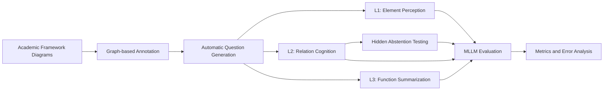
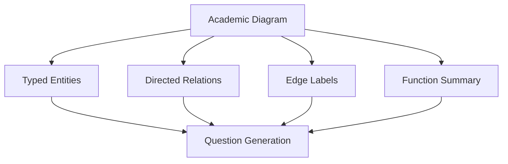
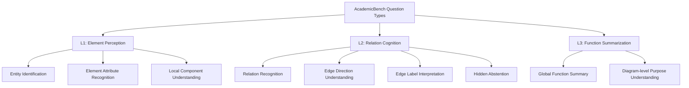
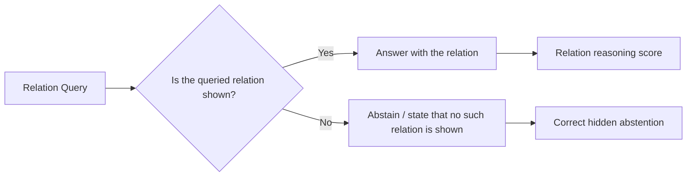
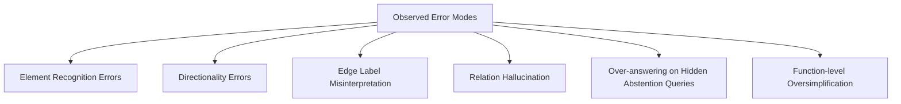

# AcademicBench: Benchmarking Multimodal Logical Reasoning over Academic Diagrams

**AcademicBench** is a benchmark for evaluating multimodal large language models (MLLMs) on structured reasoning over academic framework diagrams.

Academic framework diagrams are widely used in research papers to describe system architectures, algorithmic workflows, module relations, and conceptual structures. However, existing multimodal benchmarks mainly focus on natural images, document understanding, or statistical charts, providing limited diagnosis of whether MLLMs can reason over structured academic diagrams or abstain when a queried relation is absent.

> **Status:** Submitted to NLPCC 2026, under review.

---

## Overview

AcademicBench evaluates MLLMs across three levels of academic diagram understanding:

1. **Element Perception**  
   Identifying entities, modules, components, and visual elements in academic diagrams.

2. **Relation Cognition**  
   Understanding directed relations, edge labels, dependencies, and module interactions.

3. **Function Summarization**  
   Summarizing the overall function and high-level purpose of an academic framework diagram.

The benchmark further introduces **hidden abstention testing**, where unanswerable relation queries are mixed with answerable questions to evaluate whether models over-answer when queried relations are absent.

---

## Benchmark Pipeline



---

## Benchmark Scale

AcademicBench currently contains:

| Item | Scale |
|---|---:|
| Academic framework diagrams | **300** |
| Automatically generated questions | **~1,910** |
| Question types | **9** |
| Evaluation levels | **3** |
| Evaluated MLLMs | **9** |

---

## Annotation Schema

Each academic framework diagram is annotated as a directed graph. The annotation includes typed entities, directed relations, edge labels, and a global functional summary.



Example anonymized annotation:

```json
{
  "diagram_id": "sample_001",
  "diagram_type": "model_architecture",
  "entities": [
    {
      "id": "E1",
      "type": "module",
      "name": "Input Encoder"
    },
    {
      "id": "E2",
      "type": "module",
      "name": "Reasoning Module"
    }
  ],
  "relations": [
    {
      "source": "E1",
      "target": "E2",
      "label": "feature representation"
    }
  ],
  "function_summary": "The framework encodes input data and performs reasoning through modular interaction."
}
```

This annotation supports automatic question generation for element identification, relation reasoning, and diagram-level functional abstraction.

---

## Task Design

AcademicBench contains **nine question types** across three levels.



| Level | Reasoning Dimension | Goal |
|---|---|---|
| L1 | Element Perception | Identify entities, modules, and visual components |
| L2 | Relation Cognition | Infer directed relations, edge labels, and relation semantics |
| L3 | Function Summarization | Summarize the overall function of the framework diagram |

The L2 relation cognition level includes **hidden abstention testing**, requiring models to avoid unsupported answers when queried relations are absent.

---

## Hidden Abstention

In ordinary visual question answering, a model is usually expected to answer every question. However, in academic framework diagrams, some queried relations may not exist in the diagram.

AcademicBench therefore introduces hidden abstention testing:

- Answerable relation questions and unanswerable relation questions are mixed together.
- The model is not explicitly told which questions are unanswerable.
- A reliable model should abstain when the queried relation is absent instead of hallucinating unsupported relations.



This design helps evaluate whether MLLMs can distinguish between **inferred relations** and **non-existent relations** in structured academic diagrams.

---

## Key Findings

We evaluate **nine mainstream MLLMs** on AcademicBench.

Main findings include:

- **Relation cognition is the main bottleneck**, with an average L2 score of **0.615**, substantially lower than element-level perception.
- Models often over-answer when queried relations are absent.
- Non-abstention rates on unanswerable relation queries range from **26.2% to 99.4%**.
- A human check on sampled L2 questions reaches **95.4%**, suggesting that the observed performance gap mainly reflects model limitations rather than ambiguous question design.

---

## Error Taxonomy



Common error modes include:

1. **Element Recognition Errors**  
   Models fail to identify key modules, components, or text labels in academic framework diagrams.

2. **Directionality Errors**  
   Models recognize that two entities are related but misunderstand the direction of the relation.

3. **Edge Label Misinterpretation**  
   Models incorrectly interpret the semantic meaning of an edge label or arrow annotation.

4. **Relation Hallucination**  
   Models infer non-existent relations between entities when no such edge is present.

5. **Over-answering on Hidden Abstention Queries**  
   Models provide unsupported answers for unanswerable relation queries instead of abstaining.

6. **Function-level Oversimplification**  
   Models produce generic summaries that fail to capture the specific purpose or mechanism of the academic framework.

---

## Repository Contents

This public summary repository currently provides:

- Project overview and benchmark design
- Anonymous sample annotations
- Sample generated questions
- Summary results and error taxonomy
- Demo files for illustrating the evaluation workflow

The full dataset, original diagram images, and complete evaluation outputs are not publicly released during the review period.

---

## Suggested Public Directory Structure

The following structure is designed for this public summary repository. It may differ from the full private research codebase.

```text
AcademicBench/
├── README.md
├── docs/
│   └── AcademicBench_OnePage_Summary.pdf
├── examples/
│   ├── sample_annotation_anonymized.json
│   ├── sample_questions_anonymized.json
│   └── sample_evaluation_output.json
├── results/
│   ├── model_results_summary.csv
│   └── error_taxonomy.md
└── scripts/
    ├── generate_questions_demo.py
    ├── evaluate_demo.py
    └── metrics_demo.py
```

---

## Research Directions

AcademicBench can support future research on:

- Multimodal large language model evaluation
- Structured visual reasoning
- Academic diagram understanding
- Hidden abstention and hallucination analysis
- Benchmark construction for scientific and technical diagrams
- Error diagnosis of MLLMs on relation-level reasoning tasks

---

## Citation

The paper is currently under review. Citation information will be updated after publication.

---

## Contact

Peilin Jia  
Email: your_email@example.com
